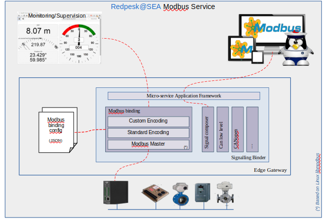

# Architecture presentation

Modbus binding supports TCP Modbus and RTU Modbus (serial) with format
conversion for multi-register type as int32, Float, ...

Be aware that the serial implementation has a limitation: the binding
can currently only manage one Remote Terminal Unit per tty device.

For more information about installation, run and test, click on the
following links:

* [Installation Guide](./2-installation_guide.html)
* [Running and Testing](./4-running_and_testing.html)
* [Configuration](./3-configuration.html)
