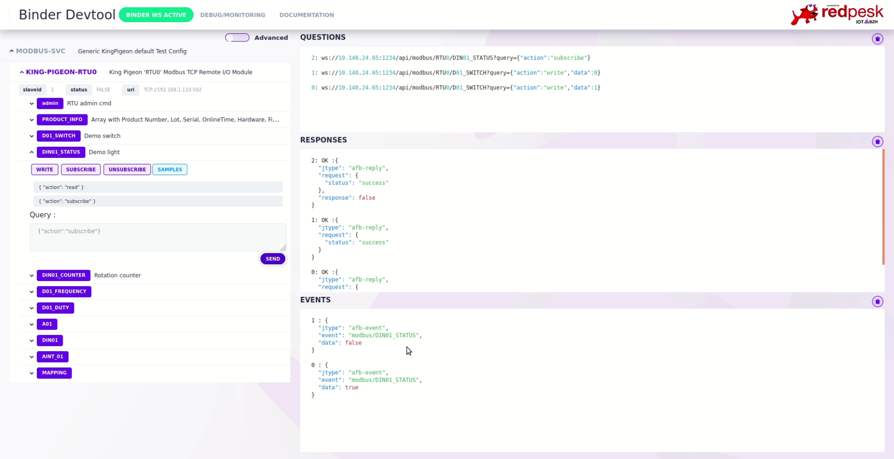

# Running/Testing

## Serial sniffing

When writing a new format plugin, or simply a configuration, it can be
useful to see the binary data transmitted by the binding, and received
from the serial link. A program such as `intercerptty` allows you to do
that by acting as a proxy between the binding and the real serial
device.

### Compilation

`interceptty` does not figure in many repositories and has to be built
from [its sources](https://github.com/geoffmeyers/interceptty). Clone
this repo and run the following commands:

```bash
git clone https://github.com/geoffmeyers/interceptty
./configure
make
```

### Usage

```bash
interceptty /dev/ttyUSB0
```

You have to use `/tmp/interceptty` as your serial device in the binding
instead of `/dev/ttyUSB0`. `interceptty` will then display all the data
which goes through `/dev/ttyUSB0`.

## Kingpigeon devices

By default Kingpigeon devices uses a fixed IP address (192.168.1.110).
You may need to add this network to your own desktop config before
starting your test. Check hardware documentation on
[Device Store / King Pigeon]()

```bash
sudo ip a add 192.168.1.1/24 dev eth0 # eth0, enp0s20f0u4u1 or whatever is your ethernet card name
ping 192.168.1.110 # check you can ping your TCP modbus device
# check default config with browser at http://192.168.1.110
```

## Start sample Binder

```bash
afb-binder --binding=./build/modbus-binding.so --config=./config-samples/control-modbus_kingpigeon-config.json -vvv
```

Open the binder devtool with your browser at <http://localhost:1234/devtools/index.html>



## Test binding in CLI

```bash
afb-client --human ws://localhost:1234/api
# you can now send requests with the following syntax : <api> <verb> [eventual data in json format]
# here are some available examples for modbus binding :
modbus ping
modbus info
modbus RTU0/D01_SWITCH {"action":"write","data":1}
modbus RTU0/D01_SWITCH {"action":"read"}
modbus RTU0/D01_SWITCH {"action":"write","data":0}
modbus RTU0/D01_SWITCH {"action":"read"}
```

## About timeouts

A request which has timed out will have a status code of `-1001`.

A time out can be a symptom of multiple causes:

- the RTU you're using is slower than the default timeout value we use
  in configurations (250ms). Try to increase this value to something
  which fits your RTU better.
- you are sending a Modbus command which is not supported by the RTU,
  and it simply does not reply (instead of sending an "Illegal function"
  error for instance). You can use `interceptty` to debug your problem,
  as described in [Configuration](./3-configuration.html).

## Adding your own config

While developing, a configuration of the format show in the
[config-samples directory](https://github.com/redpesk-industrial/modbus-binding/blob/master/config-samples/)
is passed to the binder using the `--config=` option.

For production, redpesk's `modbus-binding` package should be used.
`modbus-binding` is actually a resource binding, not a service; what
means it cannot be ran as provided. For that you need to create a
separate package containing your configuration and a manifest file which
indicates that you provide a configuration for another binding.
[More details about resource bindings here]().

**Warning:** some TCP Modbus devices, as KingPigeon's, check SlaveID
even for building I/O. Config samples make the assumption that your
slaveID is set to `1`.
